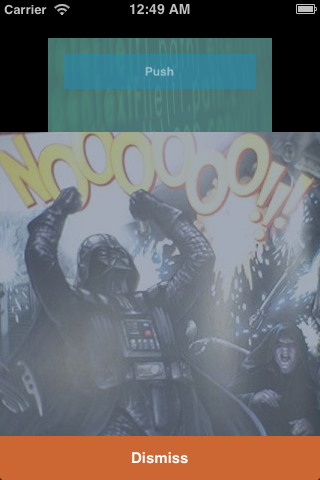

eLBeePushBackController
=======================



** Update: This is currently being rewritten - made some silly overkill mistakes here.. **

## About

eLBeePushBackController us a simple, lightweight UIViewController Category for creating a semi modal / push back transition.  

This code was originally a fork of [kentnguyen's](https://github.com/kentnguyen) [KNSemiModal](https://github.com/kentnguyen/KNSemiModalViewController) category.  

### Biggest Changes

* Refactored a lot of the animation code and split things out into more manageable chunks.
* Added blocks and GCD to improve performance
* I replaced the screenshot resize for the push back animation transition with just a simple resizing of the main view.
* Removed all objc runtime properties as they are not yet needed at this time
* Overall, reduced the size of the build drastically, which also has added in a bit of a performance bump
* Disabled user interaction to the background view for now - will probably just have it dismiss when that is tapped eventually.. 


### In Development:
* I'm working on some new transition styles so that you can choose which transition to use

### Things I removed:
* Removed "presentSemiView". Why? Because I never used it and only used this for controllers. I plan to add it back when I need it though ...
* the Dismiss block for the present methods (temporarily). Going to decide how to handle this later (will probably create a simpe NSNotification call rather than storing it with objc runtime properties)
* The most important thing I removed was calls to "shouldRasterize" and "rasterizationScale". These 2 calls create awful responses and just aren't worth the little details they offer with this code. I'm not hating on rasterize - just saying - it sucks here =)
* Removed all of the traversal searches for the parentview. I just personally didn't need it and found it slowed stuff down. If you want it - let me know and I'll add it (or create a pull request!)
* Removed the shadow layers - again, slowed the animation down and I quite honestly just didn't care if shadows were shown or not
* All objc_runtime properties (obviously)
* All of the define methods (replaced the tags with NS_ENUM instead)
* All of the subclasses/categories
* Removed the "options" param (I never used it personally - if you do - sorry =)
* Removed the screenshot creation

### Things that I kept/borrowed/whatever from KNSemiModal:
* The transform3d logic for scaling/rotating
* callback methods for completion
* some of the animation routines
* the overlay view

Finally, here is a quick example of how to use it.  Check out the example in the included project to see it live.

## Example

#### MainViewController.m
```objective-c

#import "MainViewController.h"
#import "ModalViewController.h"
#import "UIViewController+eLBeePushBackController.h"

@interface MainViewController() <ModalVCDelegate>

@end

@implementation MainViewController

-(IBAction)presentPBVCBtn:(id)sender {
    ModalViewController *controller = (ModalViewController *)[self.storyboard instantiateViewControllerWithIdentifier:@"ModalViewControllerSBID"];
    controller.delegate = self;  // This is not necessary - is good to just let your main view handle presenting/dismissing

    [self presentPushBackController:controller];

    /*
    // Example using withCompletion
    [self presentPushBackController:controller withCompletion:^{
        NSLog(@"The View was pushed and has completed!");
    }];
    */
}

-(void)pushBackVCDelegateShouldDismissController:(ModalViewController *)controller {

    controller.delegate = nil;

    [self dismissPushBackController:controller];
    /*
     // Example using withCompletion
     [self dismissPushBackController:controller withCompletion:^{
     NSLog(@"The View was pushed and has completed!");
     }];
     */
}
@end

@end
```

#### ModalViewController.h
```objective-c

#import <UIKit/UIKit.h>

@class ModalViewController;

@protocol ModalVCDelegate <NSObject>
-(void)pushBackVCDelegateShouldDismissController:(ModalViewController *)controller;
@end


@interface ModalViewController : UIViewController

@property (nonatomic, weak) id <ModalVCDelegate> delegate;

@end


```


#### ModalViewController.m
```objective-c

#import "ModalViewController.h"

@interface ModalViewController()
-(IBAction)dismissAction;
@end


@implementation ModalViewController

-(IBAction)dismissAction {
    [self.delegate pushBackVCDelegateShouldDismissController:self];
}

@end
```


Thanks, hope you find this useful!!


## Resources
[KNSemiModal](https://github.com/kentnguyen/KNSemiModalViewController)

[Stackoverflow - UIView Cloning](http://stackoverflow.com/a/13664732)


## Contact Info

Website: [http://phpadvocate.com/](http://phpadvocate.com/)

LinkedIn: [http://www.linkedin.com/in/jhibbard/](http://www.linkedin.com/in/jhibbard/)

Twitter: [https://twitter.com/infolock](https://twitter.com/infolock)
